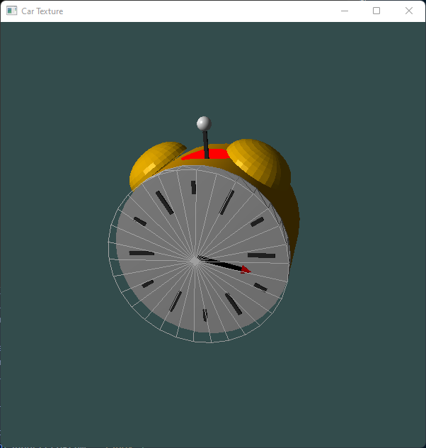

# Alarm clock ⏲️ opengl

  

## What's it about?

Opengl application in which an alarm clock is displayed.  
Once the program has run, an alarm with dynamic hands and hammer will be displayed.  
To stop the clockwise rotation of the hand, keep the R key pressed.  
To activate / stop the oscillation of the hammer between between -π/12 and +π/12 along the y axis, click on the S key.  
To activate the hammer movement as soon as the hand reaches the vertical y axis (12 o'clock), click key A.  
